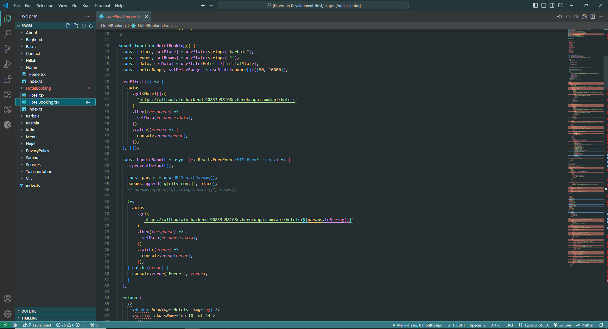

# Ocean Mist

Ocean Mist is modern VS Code theme inspired by the calming aqua color, designed for readability and focus.

---

## Installation

1. Open VS Code and navigate to the Extensions view by pressing `Ctrl+Shift+X`.
2. Search for the theme: **ocean mist**.
3. Click the **Install** button.
4. Open the Command Palette (`Ctrl+Shift+P` or `Cmd+Shift+P` on macOS) and select **Preferences: Color Theme**.
5. Choose **Ocean Mist** from the list.

---

## Features

- **Fresh Color Palette**: Built around the calming aqua shade `#49aaba`.
- **Readable Syntax Highlighting**: Carefully chosen foreground and background colors to ensure readability.
- **Consistent UI**: Unified styling across the editor, activity bar, sidebar, and terminal.
- **Accessible Links**: Highlighted links with custom hover effects.

---

## Screenshots

---

## Contributing

If you have any suggestions or want to contribute to this theme:

1. Fork this repository. `https://github.com/Malik-Haziq/Ocean-Mist-Vscode-Theme.git`
2. Create a new branch: `git checkout -b feature-branch-name`.
3. Make your changes and commit: `git commit -m 'Add feature'`.
4. Push to your branch: `git push origin feature-branch-name`.
5. Open a pull request.

---

## Feedback

Feel free to share feedback or report bugs by creating an issue on the GitHub repository. Your input is valuable!

---

## About Me

Hi, I'm Malik Haziq, a passionate Frontend Engineer with expertise in creating visually stunning and functional web applications. I've been working with tools like HTML, CSS, JavaScript, React, and TypeScript since 2018.

If you want to collaborate or just want to discuss cool projects, feel free to reach out:

- **LinkedIn**: [Linkedin](https://www.linkedin.com/in/malik-haziq-b5233a231/)
- **GitHub**: [Github](https://github.com/Malik-Haziq)
- **Email**: [Email](malikhaziq153@gmail.com)

---

## License

This theme is licensed under the [MIT License](LICENSE).

---

Enjoy coding with **Ocean Mist**! 😊
